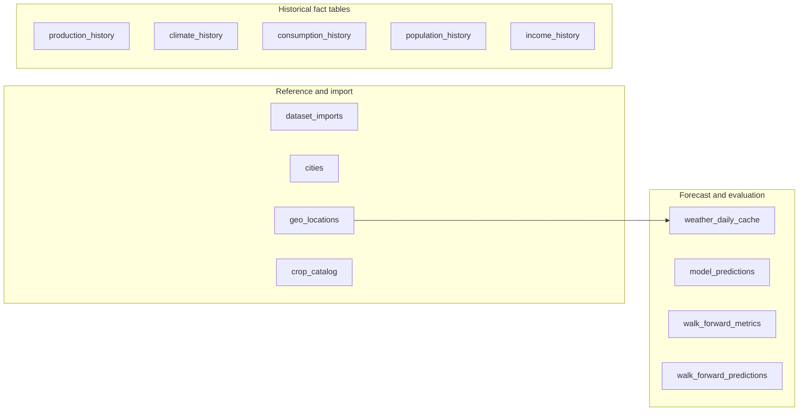

# TarimPro Veritabani Semasi

Kaynak DDL: [`backend/db/schema.sql`](../backend/db/schema.sql)

Not: Diyagramlarda tipler sadelestirildi. Exact `varchar` uzunluklari ve `numeric` precision degerleri icin kaynak SQL dosyasina bakabilirsin.

## 1) App semasi

```mermaid
erDiagram
    APP_USERS ||--o{ APP_USER_SESSIONS : has
    APP_USERS ||--o{ APP_FIELDS : owns
    APP_USERS ||--o{ APP_PRODUCTION_PLANS : creates
    APP_USERS ||--o{ APP_ALERTS : receives
    APP_FIELDS ||--o{ APP_PRODUCTION_PLANS : used_by
    APP_FIELDS ||--o{ APP_ALERTS : linked_to
    APP_PRODUCTION_PLANS ||--o{ APP_AI_ANALYSES : analyzed_by
    APP_AI_ANALYSES ||--o{ APP_AI_RECOMMENDATIONS : suggests

    APP_USERS {
        uuid id PK
        string tc_identity_no UK
        string phone UK
        string email UK
        string password_hash
        string full_name
        string city
        string district
        date member_since
        string role
        bool active_badge
        bool is_active
        datetime created_at
        datetime updated_at
    }

    APP_USER_SESSIONS {
        uuid id PK
        uuid user_id FK
        string token_hash UK
        bool remember_me
        datetime expires_at
        datetime last_seen_at
        datetime revoked_at
        datetime created_at
    }

    APP_FIELDS {
        uuid id PK
        uuid user_id FK
        string name
        string city
        string district
        string region_code
        number area_decare
        string soil_type
        number latitude
        number longitude
        string notes
        datetime created_at
        datetime updated_at
    }

    APP_PRODUCTION_PLANS {
        uuid id PK
        uuid user_id FK
        uuid field_id FK
        string selected_crop_name
        string region_code
        int season_year
        string status
        number target_yield_percent
        number planned_area_decare
        date planned_sowing_date
        date planned_harvest_date
        string city
        string district
        datetime created_at
        datetime updated_at
    }

    APP_AI_ANALYSES {
        uuid id PK
        uuid plan_id FK
        number score
        number confidence_score
        string summary
        string climate_comment
        string market_comment
        string model_name
        string selected_crop_name
        string focus_crop_name
        string city
        string district
        int forecast_year
        number planned_area_decare
        number expected_yield_kg_decare
        number expected_production_ton
        json score_breakdown
        datetime analyzed_at
    }

    APP_AI_RECOMMENDATIONS {
        uuid id PK
        uuid analysis_id FK
        int rank_order
        string crop_name
        number expected_return_percent
        number recommendation_score
        int forecast_year
        number predicted_production_ton
        number expected_yield_kg_decare
        number expected_production_ton
        string reason
    }

    APP_ALERTS {
        uuid id PK
        uuid user_id FK
        uuid field_id FK
        uuid plan_id FK
        string alert_type
        string title
        string message
        bool is_read
        datetime created_at
    }
```

## 2) Analytics semasi

Bu katmanda tablolarin cogu FK ile degil, `city_name`, `product_name`, `year` ve `forecast_year` gibi alanlar uzerinden mantiksal olarak baglaniyor. Tek fiziksel FK, `weather_daily_cache.location_id -> geo_locations.id`.

## 3) Tablo Ozeti

| Schema | Table | Rol | Kritik alanlar |
| --- | --- | --- | --- |
| app | users | Sistem kullanicilari | `tc_identity_no`, `phone`, `email`, `role`, `active_badge` |
| app | user_sessions | Bearer token tabanli oturumlar | `user_id`, `token_hash`, `expires_at`, `revoked_at` |
| app | fields | Kullanici tarlalari | `user_id`, `name`, `city`, `district`, `area_decare` |
| app | production_plans | Ekim / uretim planlari | `user_id`, `field_id`, `selected_crop_name`, `season_year`, `status` |
| app | ai_analyses | Plan bazli AI analiz snapshot'lari | `plan_id`, `score`, `confidence_score`, `forecast_year` |
| app | ai_recommendations | Analiz icin alternatif urun onerileri | `analysis_id`, `rank_order`, `crop_name`, `recommendation_score` |
| app | alerts | Kullanici uyarilari | `user_id`, `field_id`, `plan_id`, `alert_type`, `is_read` |
| analytics | dataset_imports | Import takip kaydi | `dataset_name`, `source_file`, `imported_table`, `row_count` |
| analytics | cities | Il referans listesi | `city_name`, `plate_code` |
| analytics | geo_locations | Il / ilce koordinatlari | `city_name`, `district_name`, `latitude`, `longitude`, `provider` |
| analytics | weather_daily_cache | Gunluk hava durumu cache | `location_id`, `forecast_date`, `temperature_c`, `precipitation_mm` |
| analytics | crop_catalog | Urun katalogu | `category_name`, `product_code`, `product_name`, `production_method` |
| analytics | production_history | Tarihsel uretim verisi | `year`, `city_name`, `product_name`, `production_ton`, `yield_kg_decare` |
| analytics | climate_history | Tarihsel iklim verisi | `observation_date`, `city_name`, `temperature_avg_c`, `rainfall_mm` |
| analytics | consumption_history | Tuketim serileri | `year`, `product_name`, `metric_name`, `value`, `trend` |
| analytics | population_history | Nufus serileri | `year`, `level_name`, `total_population` |
| analytics | income_history | Gelir serileri | `year`, `geography_name`, `income_type`, `income_amount` |
| analytics | model_predictions | Model tahmin ciktilari | `model_name`, `year`, `city_name`, `product_name`, `predicted_production_ton` |
| analytics | walk_forward_metrics | Walk-forward metrikleri | `model_name`, `origin_year`, `forecast_year`, `horizon`, `rmse`, `wape_pct` |
| analytics | walk_forward_predictions | Backtest tahmin satirlari | `model_name`, `origin_year`, `forecast_year`, `actual_production`, `predicted_production` |

## 4) Indeks ve benzersizlikler

- `app.users`: `tc_identity_no`, `phone`, `email` unique
- `app.user_sessions`: `token_hash` unique
- `app.fields`: `idx_fields_user_id`
- `app.production_plans`: `idx_plans_user_id`, `idx_plans_city_year`
- `app.alerts`: `idx_alerts_user_id`
- `app.ai_analyses`: `idx_ai_analyses_plan_id`
- `app.ai_recommendations`: `idx_ai_recommendations_analysis_id`
- `analytics.geo_locations`: `(city_name, district_name)` unique
- `analytics.weather_daily_cache`: `(location_id, forecast_date)` unique
- `analytics.production_history`: `idx_production_history_year_city`
- `analytics.climate_history`: `idx_climate_history_date_city`
- `analytics.consumption_history`: `idx_consumption_history_year_product`
- `analytics.model_predictions`: `idx_model_predictions_year_product`
